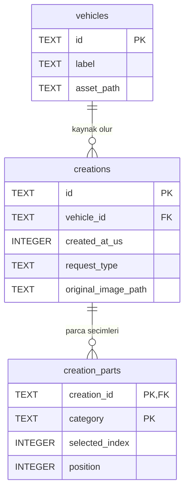

# SQLite geçmişi — tablo ilişkileri ve güvenli geçiş

> Bu belge ilk v1 geçmiş geçişinin kaydıdır. Güncel v2 sürümünde seçimler ve
> kataloglar da SQLite'tadır; `creation_parts` katalog seçeneklerine FK ile
> bağlanmıştır. Güncel kullanım için [SQLite katalog rehberini](sqlite_catalog.md) okuyun.

9 Ekim 2026. Üretim geçmişi artık `SqliteCreationRepository` üzerinden
cihazdaki `modyai.db` dosyasına kaydedilir. Küçük form seçimleri
`modyai.v1.selections` anahtarıyla SharedPreferences'ta kalır.
Gerçek AI, hesap sistemi, bulut eşitleme veya galeri eklenmedi.

## Primary key ve foreign key

**Primary key (PK)** bir satırın benzersiz kimliğidir; aynı tabloda iki
satır aynı PK'yi alamaz. **Foreign key (FK)** başka tablonun satırına
referans verir. Referans verilen satır yoksa kayıt kabul edilmez.



`o{` sıfır veya daha fazla demektir. Her üretimin tam bir kaynak aracı,
her parça satırının tam bir üretimi vardır. Araç henüz kullanılmamış,
üretim de parçasız olabilir.

### 1. vehicles — örnek araç kataloğu

- PK: `id TEXT NOT NULL PRIMARY KEY`; örneğin `porsche_911`, `mustang_gt`.
- `label`, `asset_path`: katalog adı ve uygulamayla gelen fotoğrafın yolu.
- İlk veritabanı oluşturulurken mevcut `VehicleCatalog.all` içeriği eklenir.
- Bunlar fiziksel araç sahipliği/VIN kayıtları veya kullanıcının yüklediği
  araçlar değildir. Bugünkü hazır görsel kataloğunun kimlikleridir.

### 2. creations — tamamlanmış demo işlemleri

- PK: `id TEXT NOT NULL PRIMARY KEY`. Mevcut geçmiş kimlikleri korunur.
  Cubit yeni işlem için oturum kimliği + sıra numarası üretir; çakışma
  veritabanınca reddedilir. Araç kimliği PK değildir: aynı araçla birçok
  ayrı başarılı işlem yapılabilir. Auto-increment ID'ye dönüştürülmez.
- FK: `vehicle_id → vehicles.id` (**many-to-one / N:1**). Araç tarafından
  bakıldığında **one-to-many / 1:N**. Bir Porsche için üç başarılı işlem
  varsa bir `vehicles` satırı ve üç farklı `creations` satırı vardır.
- `created_at_us`: UTC Unix epoch'tan itibaren mikro-saniye, INTEGER.
  Mikro-saniye hassasiyetinde doğru sıralama için metin tarih kullanılmaz.
- `kind`: şu an yalnız `demo` kabul edilir.
- `request_type`: `generate`, `explore` veya `video`; video-demo sayacı
  bu alanla ayrılır. Video isteği gerçek video üretildiği anlamına gelmez.
- `original_image_path`: o işlemin orijinal görsel referansı.
- Diğer sütunlar: `mode`, `style`, `extra`, `color`, `angle`, `description`,
  `operation`, `option_id`, `reference_id`, `template`. İşleme ait olmayan
  alanlar boş kalır; uygulamadaki mevcut tipli istek doğrulaması kullanılır.
- `option_id` ve `reference_id` bu sürümde SQL foreign key değildir;
  uygulamanın ayrı modifikasyon/referans kataloglarında doğrulanır.

### 3. creation_parts — Detail Edit parça seçimleri

- **Bileşik PK:** `(creation_id, category)`. Bir üretimde aynı kategori
  iki kez bulunamaz, fakat başka üretimlerde aynı kategori bulunabilir.
- FK: `creation_id → creations.id` (**N:1**).
- `selected_index`: mevcut parça kataloğundaki seçilen seçenek indeksi;
  bir foreign key veya global parça ID'si değildir.
- `position`: seçim sırasını korur. `(creation_id, position)` ayrıca UNIQUE.
- Örnek: `creation_A / Spoiler / 2 / 0` ve
  `creation_A / Exhaust / 0 / 1` aynı üretimin iki parça satırıdır.

### 4. migration_log — taşıma kaydı

- PK: `migration_key`; şu an `shared_preferences_creations_v1`.
- `completed_at_utc`: aktarımın tamamlandığı UTC tarih metni.
- Diğer tablolarla ilişkisi yok; aynı aktarımın tekrar yapılmasını engeller.
- Bu tablo SQL şema sürümünden ayrıdır. Şema sürümü SQLite `user_version=1`
  ve sqflite `version: 1` ile yönetilir.

## Neden 1:1 veya many-to-many tablo eklemedik?

- Şimdilik her işlem tek demo sonucuna sahip. Sonuç alanları `creations`
  satırında tutulur; ayrı bir 1:1 sonuç tablosu gerekmiyor.
- Parça seçimleri üretime aittir; bağımsız, paylaşılabilir bir `parts`
  tablosu olmadığı için bugünkü şema many-to-many değildir.
- Kullanıcı girişi yokken varsayımsal bir `users` tablosu eklenmedi.
  İleride hesaplar eklenirse kullanıcı → üretimler 1:N olarak tasarlanabilir.
- Your Creations ve Garaj için iki ayrı tablo yok: aynı `creations`
  kayıtlarının farklı görünümleridir. Sayaçlar ayrıca saklanmaz.

## Veri bütünlüğü ve silme kuralları

- Her bağlantı açılırken `PRAGMA foreign_keys = ON` etkinleştirilir.
- Kullanılmış araç silinemez: `creations.vehicle_id ON DELETE RESTRICT`.
- Bir üretim SQL düzeyinde silinirse kendi parça satırları da silinir:
  `creation_parts.creation_id ON DELETE CASCADE`.
- Uygulamaya bu çalışma kapsamında silme düğmesi eklenmedi.
- `save` mevcut API'yle liste alır ama yalnız yeni ID'leri ekler. Aynı
  ID/aynı içerik tekrar yazılmaz; aynı ID/farklı içerik reddedilir.
  Eksik/eski bir liste mevcut geçmişi silmez. Gelecekte silme için açık bir
  repository metodu gerekir; `save([])` geçmiş temizleme komutu değildir.
- Parent/child yazımları tek transaction'dır. Hata olursa tümü geri alınır.
- Araç, tarih ve tür+tarih indeksleri vardır. UI hâlâ listeyi belleğe yükler;
  SQL sayfalama/arama bu geçişte eklenmedi.
- Katalog/şema değişikliği ileride yeni sürüm ve açık migration gerektirir;
  daha yeni bir DB sürümü bu uygulamayla açılırsa silerek sıfırlanmaz.

## SharedPreferences'tan geçiş

1. SQLite dosyası açılır, gerekiyorsa şema ve katalog oluşturulur.
2. `migration_log` içinde tamamlanma kaydı varsa eski cache okunmaz.
3. Yoksa eski `CreationCacheManager` bütün kayıtları okuyup doğrular.
4. Kayıtlar, parçalar ve tamamlandı işareti **aynı transaction** ile yazılır.
5. Bundan sonraki geçmiş yazımları SQLite'a gider. Eski preferences değeri
   kurtarma kopyası olarak korunur; seçim anahtarına dokunulmaz.

Bozuk/eski sürüm JSON, okuma hatası, çakışan ID veya SQL hatası sessiz veri
kaybına çevrilmez. Tamamlandı işareti yazılmaz; mevcut uyarı/tekrar dene
akışı kullanılır. Eski sürüme dönüp preferences'a yeni kayıt yazmak iki
depoyu eşitlemez; otomatik downgrade/iki yönlü senkronizasyon yoktur.

## DB dosyası nerede?

`getDatabasesPath()` + `modyai.db`: uygulamanın çalıştığı Android/iOS
cihazının uygulamaya özel veritabanı klasörü. Bilgisayardaki DB Browser'ın
kurulu olduğu klasör değil. `main.dart` üretim için SQLite repository verir;
test/önizlemede `MyApp` varsayılan bağımsız bellek deposunu korur.

Android debug sürümünde Android Studio Device Explorer ile uygulamanın
`databases/modyai.db` dosyası görülebilir. DB Browser'da incelemek için
uygulama kapalıyken tutarlı bir kopya alınmalı; aktif WAL kullanılıyorsa
yalnız ana dosyayı kopyalamak son kayıtları kaçırabilir.

Örnek okuma sorguları:

```sql
SELECT request_type, COUNT(*) FROM creations GROUP BY request_type;

SELECT c.id, v.label, c.request_type,
       datetime(c.created_at_us / 1000000, 'unixepoch') AS created_at_utc
FROM creations AS c
JOIN vehicles AS v ON v.id = c.vehicle_id
ORDER BY c.created_at_us DESC;

SELECT creation_id, category, selected_index, position
FROM creation_parts ORDER BY creation_id, position;

PRAGMA foreign_key_check;
PRAGMA integrity_check;
```

## Testler ve platform kapsamı

Yeni `sqlite_creation_repository_test.dart`, gerçek SQLite motoruyla geçici
disk dosyaları üzerinde çalışır; native test bağlantısı için
`sqflite_common_ffi` yalnız dev dependency'dir. Mobil uygulama `sqflite`
kullanır; bilgisayardaki `sqlite3.exe` programına bağımlı değildir.
Windows desktop/web uygulama desteği bu çalışmada eklenmedi.

70 yeni test: 55 istek türünün diskten geri okunması, tek seferlik aktarım,
bozuk legacy verinin korunması, retry, SQL rollback, PK/FK/cascade,
mikro-saniye sırası, eski snapshot, eşzamanlı çağrılar, yeni sürümü reddetme
ve SQLite destekli gerçek Generate → Garaj widget akışının yeniden açılışı.

9 Ekim 2026 doğrulaması: **933 test başarılı** (863 mevcut + 70 yeni),
`flutter analyze --no-pub` temiz, `flutter build apk --debug --no-pub`
başarılı. FFI testleri gerçek SQLite dosyaları üzerinde çalıştı; bu,
Android native eklentisinin cihaz testi değildir. Bu çalışma sırasında
`adb devices` bağlı cihaz göstermediği için kullanıcının emülatöründeki
gerçek geçmişin yerinde taşınması henüz manuel olarak doğrulanmadı.
SharedManager'daki kullanıcı değişikliği olan `mimport` yazım hatası,
kullanıcının açık onayıyla `import` olarak düzeltildi.

Yeni native paket nedeniyle uygulamayı durdurup `flutter run` ile yeniden
başlatmak gerekir; hot reload yeterli değildir. Uygulama verilerini silmeyin.

Kaynaklar: [sqflite — transaction ve sürümleme](https://pub.dev/packages/sqflite),
[SQLite foreign key kuralları](https://www.sqlite.org/foreignkeys.html),
[Flutter SQLite rehberi](https://docs.flutter.dev/cookbook/persistence/sqlite).
Önceki derslerden alınan model/repository/state ayrımı korunur; bu SQLite
şemasının öğretmenin hazır örneği olduğu veya yeni video incelendiği iddia edilmez.
